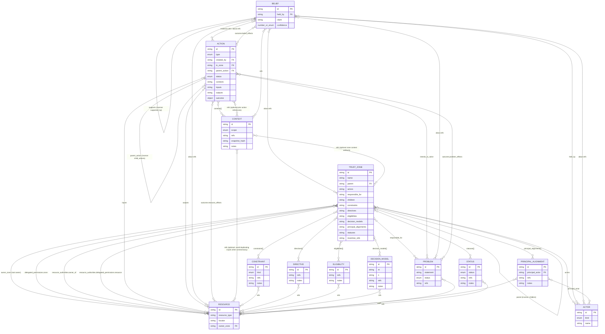

# Data Model ER Diagram (Mermaid)

> AUTO-GENERATED from `model/model.schema.json`

```mermaid
erDiagram
    ACTOR {
      string id PK
      enum kind
      string name
    }

    TRUST_ZONE {
      string id PK
      string name
      string parent FK
      string actors
      string responsible_for
      string children
      string constraints
      string directives
      string eligibilities
      string decision_models
      string principal_alignments
      string statuses
      string incentive_refs
    }

    PROBLEM {
      string id PK
      string statement
      enum status
      string refs
    }

    RESOURCE {
      string id PK
      string resource_type
      string locator
      string owner_zone FK
    }

    BELIEF {
      string id PK
      string held_by FK
      string claim
      number_or_enum confidence
    }

    CONSTRAINT {
      string id PK
      enum kind
      string refs
      string notes
    }

    DIRECTIVE {
      string id PK
      string refs
      string notes
    }

    ELIGIBILITY {
      string id PK
      string refs
      string notes
    }

    DECISION_MODEL {
      string id PK
      string m
      string n
      string refs
      string notes
    }

    CONTEXT {
      string id PK
      enum scope
      string refs
      string snapshot_hash
      string notes
    }

    ACTION {
      string id PK
      enum type
      string created_by FK
      string in_zone FK
      string parent_action FK
      enum status
      string contexts
      string inputs
      string outputs
      object outcome
    }

    PRINCIPAL_ALIGNMENT {
      string id PK
      string principal_actor FK
      string refs
      string notes
    }

    STATUS {
      string id PK
      enum status
      string refs
      string notes
    }

    TRUST_ZONE }o--o{ ACTOR : "actors"
    TRUST_ZONE ||--o{ TRUST_ZONE : "parent (inverse: children)"
    TRUST_ZONE }o--o{ PROBLEM : "responsible_for"
    ACTION }o--o{ PROBLEM : "intends_to_solve"
    TRUST_ZONE }o--o{ RESOURCE : "owner_zone (root owner)"
    TRUST_ZONE }o--o{ RESOURCE : "delegated_permissions.zone"
    TRUST_ZONE }o--o{ RESOURCE : "resource_authorities.owner_of"
    TRUST_ZONE }o--o{ RESOURCE : "resource_authorities.delegated_permissions.resource"
    ACTION }o--o{ RESOURCE : "inputs"
    ACTION }o--o{ RESOURCE : "outputs"
    ACTION ||--o{ ACTION : "parent_action (inverse: child_actions)"
    BELIEF }o--o{ ACTOR : "held_by"
    BELIEF ||--o{ BELIEF : "supports (inverse: supported_by)"
    BELIEF }o--o{ ACTOR : "about.refs"
    BELIEF }o--o{ TRUST_ZONE : "about.refs"
    BELIEF }o--o{ PROBLEM : "about.refs"
    BELIEF }o--o{ RESOURCE : "about.refs"
    BELIEF }o--o{ ACTION : "evidence.refs / about.refs"
    ACTION }o--o{ BELIEF : "outcome.belief_effects"
    ACTION }o--o{ PROBLEM : "outcome.problem_effects"
    ACTION }o--o{ RESOURCE : "outcome.resource_effects"
    ACTION }o--o{ CONTEXT : "contexts[]"
    CONTEXT }o--o{ ACTION : "refs (optional prior action references)"
    CONTEXT }o--o{ TRUST_ZONE : "refs (optional zone context artifacts)"
    CONTEXT }o--o{ BELIEF : "refs"
    CONTEXT }o--o{ RESOURCE : "refs (optional; avoid duplicating inputs when unnecessary)"
    TRUST_ZONE }o--o{ CONSTRAINT : "constraints[]"
    TRUST_ZONE }o--o{ DIRECTIVE : "directives[]"
    TRUST_ZONE }o--o{ ELIGIBILITY : "eligibilities[]"
    TRUST_ZONE }o--o{ DECISION_MODEL : "decision_models[]"
    CONSTRAINT }o--o{ RESOURCE : "refs"
    DIRECTIVE }o--o{ RESOURCE : "refs"
    ELIGIBILITY }o--o{ RESOURCE : "refs"
    DECISION_MODEL }o--o{ RESOURCE : "refs"
    TRUST_ZONE }o--o{ PRINCIPAL_ALIGNMENT : "principal_alignments[]"
    PRINCIPAL_ALIGNMENT }o--o{ RESOURCE : "refs"
    PRINCIPAL_ALIGNMENT }o--o{ ACTOR : "principal_actor"
    PROBLEM }o--o{ RESOURCE : "refs"
    TRUST_ZONE }o--o{ STATUS : "statuses[]"
    STATUS }o--o{ RESOURCE : "refs"

```
